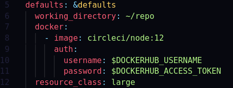
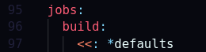

The Amplify Command Line Interface (CLI) monorepo tour is a guide for software developers by software developers. This guide aims to help new Amazon engineers and the huge awesome community of open source contributors to get started with the development and improvement of the Amplify CLI.

The goal and objective of this guide is to reduce the time taken to get familiar with the code, architecture and configuration of the large number of packages in the Amplify CLI monorepo by explaining the magic happening under the hood when you run a Amplify CLI command on your terminal.

## Pre-requisites

This guide assumes that you have followed the [local environment setup instructions](https://github.com/aws-amplify/amplify-cli/blob/master/CONTRIBUTING.md#local-environment-setup) and you are ready with an instance of `amplify-dev`.

To verify run `amplify-dev --version` in your terminal.

Now open the `amplify-cli` project in your favourite IDE.

## Structure

The Amplify CLI monorepo (multi-package repositories) has the following top level structure. This structure excludes common configuration files like `.gitignore`, markdown files and files under `files.exclude` in your project's `.vscode/settings.json` so that we can focus on the main parts.

```
├── .circleci
├── codecov.yml
├── commitlint.config.js
├── cypress
├── lerna.json
├── .lgtm.yml
├── package.json
├── packages
├── pkg
├── scripts
├── tsconfig.base.json
```

Let us explore the contents of the directories to understand different parts of the Amplify CLI.

### Continuous Integration

Amplify CLI uses [CircleCi](https://circleci.com) to automate the development process with continuous integration in their cloud.

Now go to the `.circleci` directory in your project.

You will see the following structure.

```
├── amplify_init.exp
├── amplify_init.sh
├── api.sh
├── auth.sh
├── aws_configure.exp
├── aws.sh
├── config.base.yml
├── config.yml
├── delete_api.exp
├── delete_api.sh
├── delete_auth.exp
├── delete_auth.sh
├── enable_api.exp
├── enable_auth.exp
├── local_publish_helpers.sh
└── verdaccio.yaml
```

This is a collection of `.sh` (shell scripts), `.exp` (expect scripts) and configuration files for circleci and Verdaccio (a simple, zero-config-required local private npm registry). Verdaccio uplinks the npmjs registry in the `verdaccio.yaml` file so that we can fetch packages from multiple sources in one single project.

#### Expect and Shell scripts

- Expect scripts talk with interactive programs or scripts that require user interaction.

- It works by expecting input, then the Expect script will send the response without any user interaction with the help of the following commands.

```
spawn 	 Starts a script or a program.
expect 	 Waits for program output.
send 	 Sends a reply to your program.
interact Allows you to interact with your program.
```

Example

- Go to `amplify_init.exp` script and observe line 3 - `spawn ./.circleci/amplify_init.sh $repo`.

- All expect scripts in the folder follow a similar pattern of using `spawn` command to run the relevant `.sh` scripts in the folder.

- Then `expect` and `send` commands are used in combination in the expect script.

- All these scripts are called from the CircleCI

CircleCI believes in configuration as code. Your entire continuous integration and deployment process is orchestrated through a single config file as mentioned below.

Now open the `config.base.yml` file.

This file is a collection of workflows, jobs and steps.  Workflows are responsible for orchestrating multiple jobs. Jobs are responsible for running a series of steps that perform commands. Steps run commands (such as installing dependencies or running tests) and shell scripts to do the work required for our project.

YAML allows declaring a node as an anchor. This means this node will be referred to somewhere later in the YAML.

We can use an anchor at the beginning of our config file to set these lines as our default for jobs.



Then we use an alias with each job to write less lines.



This way we didn’t just reduce the number of lines. We’ve made it easier to maintain the YAML file.

This is followed by a set of reusable commands like `update_os_packages` which can be called as steps in any job(s) in this `config`.

This is followed by a set of jobs which are the building blocks of our CI/CD pipeline. Each job must declare an executor. In our case most jobs use the docker container as executor which is defined as an anchor at the beginning of the `config` file.


Each separate job defined within our `config` will run in a unique executor. The Primary container is defined by the first image listed in the `config` file. This is where commands are executed. The Docker executor spins up a container with a Docker image.


Workflows define a list of jobs and their run order. We have 2 workflows for our Amplify CLI project:-

- `nightly_console_integration_tests` - This workflow runs jobs only on the `master` branch on a schedule using `cron`. It builds the project, publishes it to local registry and then runs amplify console integration tests.

- `build_test_deploy` - This workflow is self defining and runs a large set of jobs while defining run order, dependencies and approval to eventually make a new github release.

### Scripts

The `scripts` directory is a combination of JavaScript and TypeScript files.

```
├── constants.ts
├── echo-current-cli-version.js
├── github-common.ts
├── github-prerelease.ts
├── github-release.ts
├── link-bin.js
├── split-e2e-tests.ts
└── unified-changelog.ts
```

The `github-common.ts` has constants and utils shared by `github-prerelease.ts` and `github-release.ts`.

These scripts are used in various jobs in the CircleCI `config.base.yml` file.

The `unified-changelog.ts` script is used to generate a unified changelog and the `echo-current-cli-version.js` script is used to save new Amplify GitHub tag under the `publish_to_local_registry` job in CircleCI.

The `github-prerelease.ts` script is used to publish Amplify CLI GitHub prerelease under the `github_prerelease` job in CircleCI.

The `github-release.ts` script is used to publish Amplify CLI GitHub release under the `github_release` job in CircleCI.

The `split-e2e-tests.ts` is an interesting script which defines concurrency (no. of parallel jobs allowed) and different AWS regions which are used to run the tests. It has a long array of test suites sorted according to their runtime and utilities like `sortTestsBasedOnTime` help to achieve the same.

The execution of the `split-e2e-tests.ts` script starts from the [main function](https://github.com/aws-amplify/amplify-cli/blob/f3b1d1d66fa2705a6ee73b5732c3919cd77632f7/scripts/split-e2e-tests.ts#L306). 

The initial step is to load the `config.base.yml` file using the `loadConfig()` function. 

Then the `splitTests()` function takes the CircleCI config and converts each test inside that job into a separate job.

The last step is to generate a new `config.yml` file using the `saveConfig()` function.

### Cypress

The `cypress` directory mainly has 2 integration tests for `auth` and `api`.

```
├── fixtures
│   └── example.json
├── integration
│   ├── api_spec.js
│   └── auth_spec.js
├── plugins
│   └── index.js
└── support
    ├── commands.js
    └── index.js
```

The `auth_spec.js` file tests the withAuthenticator Sign In functionality.

The `api_spec.js` file tests the API functionality by adding and requesting data from DynamoDB.